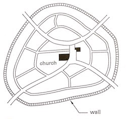
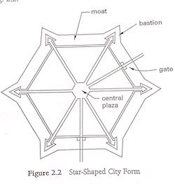
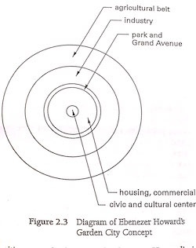
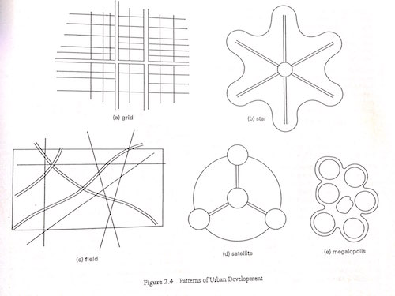

# Programming Planning and Practice #

## Chapter 2 - Environmental Analysis and Project Planning
  - Nomenclature
    - `d` vertical distance between contours ft(m)
    - `G` Slope of Land
    - `L` Horizontal distance between points of a slope ft(m)
    - Architectural design depends on understanding environmental factors that affect site selection and development. Factors include:
    - Larger context of the surrounding community and urban setting
    - Smaller scale influences from the immediate site.

## Influences on Urban Development
  - Architect must understand history and theory of the city planning to understand the relationships between individual building project and the larger context of the community and city in which it is located.
  - Larger environment affects how the site is developed and designed.
  - Building in turn affects the community of which it is part.

## Historical Influences
- First human settlements began as collections of people engaged in agricultural pursuits rather than leading nomadic life.
- As surplus food became available and ceremony/religion/leadership developed, embryonic form of city was apparent.
    - Living quarters surrounded the archetypes of the granary (food storage), temple (ceremonial rites and social interaction), and the palace (administration of village).
    - Villages were often walled in or otherwise situated for protection from other village populations or nomadic tribes seeking to take the food they could not produce.
- Greek City - contained all basic components of the city, but were more developed form.
    - Palace activities - trade and exchange of goods as well as religious ceremony, had developed to a point where separate places were required for these activities.
    - Temple - religious activity.
    - Agora - marketplace
        - Not just for trading of goods - but also for socializing, exchanging news, and conducting other business.
        - Walled cities also had other spaces - theaters, stadiums, etc.
- Form of Medieval City was similar to that of earlier villages.
    - Started at the crossroads of two main streets and was irregular in layout.
    - Medieval Cities - Organized around the church and the marketplace because these represented the two most important aspects of life.
    - Structures near the center of the city, and surrounding them was informal ring of streets loosely connected, with intersecting streets running from the church to the gates of the city wall. (See [Figure 2.1](#figure-21))

### Figure 2.1

*Above: Loose organization of Medieval Cities*

- Gunpowder - usual fortification (high wall) no longer sufficient
    - Star shaped city developed with regularly spaced bastions at points around the wall so that the entire enclosure and all approaches could be defended before the enemy could get close enough for their cannons to be effective.
    - Streets radiated from the center allowing defense control from single point. (See [Figure 2.2](#figure-22))

### Figure 2.2

*Above: Rigid pointed organization of later cities allowing for greater protection*

- During Renaissance - City Planning = more important
- Planners paid more attention to aesthetics of urban design.
    - City plans combined symmetrical order with radial layout of streets focused on points of interest
    - Primary organization of radial boulevards was overlaid on a grid of secondary streets or over an existing road system.
- Christopher Wren -> plan for rebuilding of London after the great fire of 1666 and Haussmann's plan for Paris reflect the Renaissance Renaissance and Baroque approaches.
    - Proposed main aves linking major religious and commercial facilities. These were to be superimposed on gridiron plan for other streets.
- Paris -
    - Georges-Eugene Haussman advocated straight, arterial boulevards connecting principal historic buildings, monuments and open squares. Designed to create vistas and work in conjunction with major buildings that were part of the plan.
      - 1853 - 1869 - large portion of Paris demolished to implement Haussman's plan.
      - Haussman's Plan
        - Meant to minimize riots, facilitate defense of the city, and clear out slums
        - Also improved transportation, and beautified the city.
- Austria -
    - Camillo Sitte - advocated opposite to straight boulevards
        - __City Planning According to Artistic Principles__ (1889) - Proposed that cities be laid out in Medieval ways with curving and irregular streets.
            - Stopped using T-intersections to reduce the possible number of intersection traffic conflicts.
            - Suggested civic spaces around pinwheel arrangement of streets -> `Turbine Square`
            - `Turbine Square` - Civic Spaces around pinwheel arrangement of streets.
- England
    - Industrial Revolution - 18th/19th Centuries - brought about fundamental change in the design of cities.
    - Factory system required work force be close to factory, therefore to the source of power & transportation.
    - Production expansion -> Population of factory towns ^
    - Emphasis - turning out goods, cities became overcrowded, filthy, and devoid of open space and recreation.
    - Industrial Revolution spread to northwestern Europe and northeastern US, carrying the ills of its environment.
    - Living conditions sparked reform movement.
        - First concerns - alleviate unspeakable housing conditions, reduce crowding, improve water supply & sewage systems.
        - Later realized - Open space / recreation also required.
        - Concerns sparked interest in planning of cities where factories, housing, and other features of urban life could coexist.
- Ebenezer Howard - `Garden City` (1898)
    - Combine City and Country Living in his town-country idea.
    - Proposed: 6000ac (2428 ha) tract of land be privately owned by residents.
        - Center of city - Civic Buildings in park. - Town Hall, concert hall, theatre, library, & municipal buildings.
        - Surrounding Core - Housing and shops with industrial facilities in the outermost ring
        - Urban Part - Support 30,000 people, on 1000 ac (405 ha) of land.
        - Remaining 5000 ac (2023 ha) reserved for greenbelt and agricultural use and house 2000 people.
    - Hectare [`ha`] is 10,000 m^2^

### Figure 2.3

*Above: Diagram of Ebenezer Howard's Garden City Concept*

- England
    - Two Cities built using Howard's ideas:
        - Letchworth (1903)
        - Welwyn Garden City (1920)
    - Became satellite towns, not independent cities.
- Cite Industrielle - Tony Garnier (1917)
    - Another city plan developed in response to the conditions of the Industrial Revolution.
    - Planned to be constructed in France and included separate zones linked by separated circulation paths for vehicles and pedestrians.
	- Zones:
	    - Residential
            - Public
	    - Industrial
	    - Agriculture
	- Buildings would be placed on long narrow lots with open space between.
	- This was one of the first plans to emphasize the idea of zoning, an idea that would later become vital for city planning.
- United States:
    - City planning early attempts reflected the diversity of ideas and styles brought from the Old World.
    - Towns laid out in colonies were a reaction to the Renaissance ideals and reflected the agrarian lifestyles of the settlers.
	- Planned around central commons - focus of community life.
	- Houses were freestanding structures setback from the front street, and lots included backyards.
	    - Set precedent for single family detached housing.
    - Philadelphia
	- Begun 1682 - Based on `gridiron street system` with regularly planned public open spaces and uniform spacing and setback of buildings.
    - Grid system became model for later planning in America and the new towns established as the West was settled
    - Savannah, Georgia (1733):
	- Based on ward of 40 house lots bounded by major streets in a grid system, and contained and interior square, two sides of which were reserved for public use.
    - *`Ordinance of 1785`* - Grid System encouraged.
    - `Rectangular survey system` - Divided country into a grid of 24 mi squares - subdivided into 16 townships, each 6 mi on a side -- Subdivided into 36 1 mi^2^ sections.
    - Washington D.C. - Broke grid system
	- Layout represented a significant step in city planning.
	- `Pierre Charles L'Enfant` - City Planner/Designer
	    - Based system off of Renaissance and Baroque planning concepts of diagonal and radial streets superimposed on rectangular grid.
	    - Centered on the Capitol, Mall, and executive mansion.
	    - Connected with broad avenues creating coherent transportation system based on vistas terminating in either a building or monument.
	- `Frederick Law Olmstead` - Landscape and Park Design.
	- One of first landscape designers that preserved the natural features of an area while addressing naturalistic elements.
	- `Calvert Vaux` - Architect.
	    - Teamed up together to design New York's Central Park (1850s) - inspired similar designs for metropolitan parks.
	- Also Designed Prospect Park in Brooklyn, Riverside Park in New York, Audubon Park in New Orleans, Metropolitan Parks System in Boston, and the grounds of the U.S. Capitol in D.C.
    - `Columbian Exposition` - Chicago (1893) - Designed by Architects - Daniel Burnham & John Root & Landscape Designer Frederick Olmstead.  Grouped classical buildings symmetrically around formal courts of honor, reflecting pools, and large promenades.
	- Started `City Beautiful` Movement - Revived interest in Urban Planning
	- Typical results - Civic Centers around formal parks, proliferation of classical public buildings, and broad tree lined parkways and streets.
    - 1920s - 1930s -
	- `Frank Lloyd Wright` & `Le Corbusier` envisioned cities with vast open spaces.
	- `Broadacre City` - `Wright` - every home should be situated on at least `1` acre of land
	- `Le Corbusier` - Envisioned city consisting of office and housing towers surrounded by large green spaces
	- Would have resulted in dull cities and a type of urban sprawl worse than what exists today.
    - `New Town` - Concept - Extension of idea that entirely new communities can be built away from the crowding and ugliness of existing cities.
        - Started in Great Britain (1940s) - Spread to United States and elsewhere.
        - `New Towns` - autonomous centers including housing, shopping, and business, surrounded by a greenbelt.
            - Population (originally) - 30,000 - Increased to 70,000 to 250,000 people.
            - `New Towns` built in England never became independent cities because they lacked significant employment centers.
	    - `New Towns` of Columbia, Maryland and Reston, Virginia began with the same problems as British.
	    -  Depended on jobs of nearby Washington D.C. and other areas.
        -  These `New Towns` and other Utopias: Suffered from being Static in their inception and lack the vitality and interest of a city that has evolved over time.
    -  `New Urbanism` - more recent planning philosophy that attempts to counter the many undesirable aspects of city development
        -  Factors Including:
            -  Suburban sprawl
            -  Reliance on Automobile
            -  Environmental Deterioration
            -  Housing Segregation
            -  Loss of Farmland
            -  Single-Use Development
        - Began in late 1980s because of construction of Seaside, Florida by Andres Duany and Elizabeth Plater-Zyberk.
        - Also developed by:
            - Peter Calthorpe
            - Peter Katz
        - Concepts work at various scales:
            - Building
            - Neighborhood
            - District
            - Regional levels in new developments as well as urban and suburban infill projects.
        - Primary urban design features is development of neighborhoods intended for mixed use:
            - Housing within walking distance of shops, offices and other services.
            - Variety of residential types, Apartments above shops, Single-Family Homes
	- Regional Level - Promotes connection of neighborhoods and towns to regional patterns of pedestrian, bicycle and public transit systems while reducing dependence on automobile and establishing connections to open space and natural systems.
	- Street and Building Level:
	    - Encourages individual buildings to be integrated with their surroundings
	    - Support the Street as a place for pedestrians
	    - Provide users with a clear sense of location and time.
	    - Preservation or reuse of historic structures also supported

## Development Patterns

- Urban development viewed at two scales:
    - Larger scale of city or metropolitan region
	- 20th Century:
	    -  Development determined by geographic features and layout of transportation (highway)
	    -  Cities begun near major geographic feature such as junction of two rivers or large body of water tended to develop along the water and ultimately away from it.
	    - Automobile -> Cities expanded in a few typical patterns. (See [Figure 2.4](#Figure 24))
	    - When in less confined circumstances - grew equally in all directions (uniform grid)
	- Patterns of Development:
	    - `Expanding Grid` - City formed at junction of two roads and laid out in the prevalent pattern of Philadelphia (initial plan)
		    - Growth follows grid pattern until natural feature, limiting population or economics stops it.
		    - Smaller cities - Strict Grid typical
		    - Larger Cities - Follow other patterns but usually infilled with some type of grid.
	    - `Star Pattern` - Revolves around urban core. Development follows radiating spokes of main highways or mass transit routes. Higher density development forms around spokes with lower density between.
	    - `Field Pattern` - No central focus or apparent organization scheme. Development takes place in amorphous network of highways and natural features. (Los Angeles - example)
	    - `Satellite Pattern` - Central urban core with other major cores surrounding it. Central core is linked to others with major highways, and often the outer cores are connected with a road system called a beltway. Able to travel center to center or around the city without having to go through core. Outer cores often begin as major shopping areas, peripheral business centers, or transportation centers.
	    - `Megalopolis` - Two or more urban centers near each other grow together as the space between is developed. (Northeastern US and Southern California)
    - Smaller scale of the community and neighborhood.
	- Scale of planning sites and design buildings.
	- One idea that is useful in linking the urban scale with the community scale is `imageability` - Kevin Lynch
	- `Imageability` - quality of a physical environment that gives it a high probability of evoking a strong image in the mind of a given observer.
	    - Many large scale elements interwoven with smaller community and neighborhood.
	    - However there are additional patterns of development that are also intimately related to individual site
	    - Street Pattern. Initially, community and neighborhood development followed the layout of the streets, usually a grid. Blocks between streets were subdivided into lots, and each lot was developed as a separate entity. Other approaches have occurred:
	    - SuperBlock - Out growth of new town concept.
		- Henry Wright - Radburn, NJ - One of first using this scheme.
		    - Limited automobile intrusion.
		    - Surrounded by continuous street, and vehicular access provided by cul-de-sacs.
		- Minimizes the impact of the car on housing and allows the development of pedestrian circulation and park space within the block
		- Basis for planning of:
		    - Chandigarh, India - Le Corbusier
		    - Brasilia - Lucio Costa and Oscar Niemeyer.
	    - `Planned Unit Development (PUD)` - Large parcel of land - mixed uses
		- Residential
		- Commercial
		- Recreational
		- Open Space with variable lot sizes and densities
		- Industrial
		- Must conform to certain standards
		    - Uses Permitted
		    - `Floor Area Ration (FAR)` - Ratio of Developed floor space to land area
		    - Open space Required
		    - Parking Spaces Required
		    - Living Space Ratio (open space less parking space)
		    - Maximum heights
		    - Setbacks at perimeter.
		- Advantages:
		    - Efficient use of land - Group compatible uses without unnecessary requirements of setback regulations in zoning ordinances.
			- Grouping allows extra land to be given to open space or common use areas.
			- Variety of housing options possible: single-family detached to row houses to high-rise apartments and condos.
		    - Recapture some of the diversity and variety of urban living people desire
	- __Image of the City__ - `Kevin Lynch` -
	    - Five Basic elements of the urban image:
		- Paths - Way of circulation along which people customarily, occasionally, or potentially move.
		    - Could be a street, pedestrian walkway, railroad, transit line, or river.
		    - Since they are important part of any physical environment, paths are usually at the center of a person's image.
		- Edges
		    - Linear elements other than paths that form boundaries between to districts or that break continuity.
		    - May be: Shoreline, line of buildings against park, wall, or similar.
		    - Can be seen as a path for circulation up close, but an edge from afar. (I.E. - Highway - Edge of one neighborhood, and a path when one is travelling on it).
		    - Either solid or penetrable.
		- Districts
		    - Two Dimensional areas that people perceive as having some common identifying character and that they can enter.
		    - Can be perceived from inside if one is in it or it can be identified as an element of the city if one is outside.
		    - Examples: Back Bay Boston, and Georgetown in Washington
		- Nodes
		    - Strategic centers of interest that people can enter.
		    - May be the intersections of paths, places where modes of transportation change, plazas, public squares, or centers of districts.
		- Landmarks
		    - Similar to nodes in that they are point references, but people cannot enter them.
		    - Viewed from exterior. - Tower, monument, building or natural feature.
	    - Created by buildings, natural features, roads, and other components of the city.
	    - Site planning and building design should also respond to existing image elements and enhance them if possible.

### Figure 2.4

*Above: Patterns of Urban Development*

## The Effects of Development Patterns on Social Behavior

